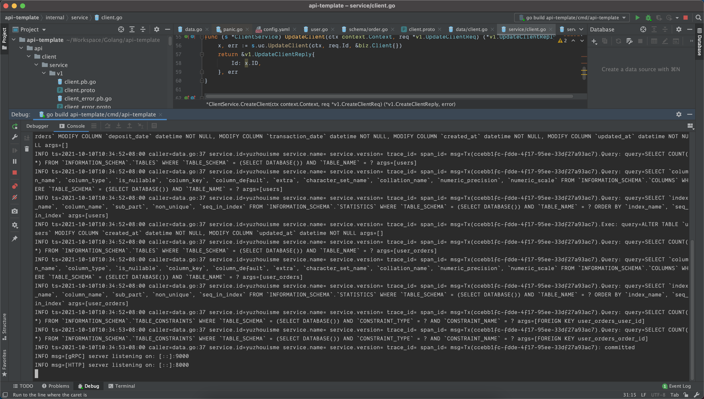
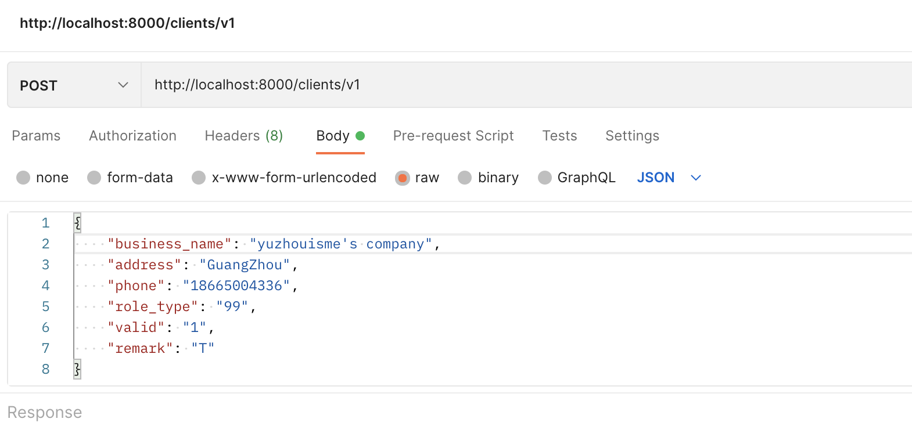
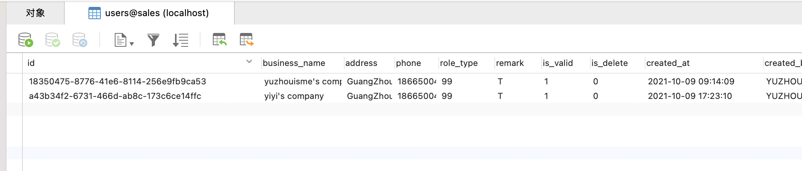

第四周作业。

##### 问题：

按照自己的构想，写一个项目满足基本的目录结构和工程，代码需要包含对数据层、业务层、API 注册，以及 main 函数对于服务的注册和启动，信号处理，使用 Wire 构建依赖。可以使用自己熟悉的框架。

##### 实现：

1. 基于 kratos 框架 v2 版本，orm选用entgo.io
2. 思考了一个近期刚用 Java 语言做的一个小功能，对客户与订单进行记录

##### 大致过程：

1. 由工程模版创建一个新工程：kratos new api-template
2. 然后跑一遍模版工程，验一下环境配置
go generate ./...
go build -o ./bin/ ./...
./bin/a -conf ./configs
3. 增加两个服务 client 和 order
4. 基于框架工具生成一些代码
kratos proto server api/sales/v1/client.proto -t internal/service
kratos proto client api/sales/v1/client.proto
5. 使用 entgo.io，基于命令生成并修改 /internal/data/ent/schema/ ，增加对象的属性
go run entgo.io/ent/cmd/ent init User
go run entgo.io/ent/cmd/ent init Order
6. 添加CRUD方法

##### 效果：

##### 待完成：

1. 错误处理，进行了多次判断 err 的值，与 Error 处理课程中描述的不符
2. entgo.io 不熟悉，待学习提高

##### 思考一个问题：

1. 要向老师请教个问题，服务间调用的场景，比如购物下单，下单成功后有个积分计算环节。如果这个时候，算积分Error了，这里怎么处理比较合理？记下来，后续再去尝试算积分？